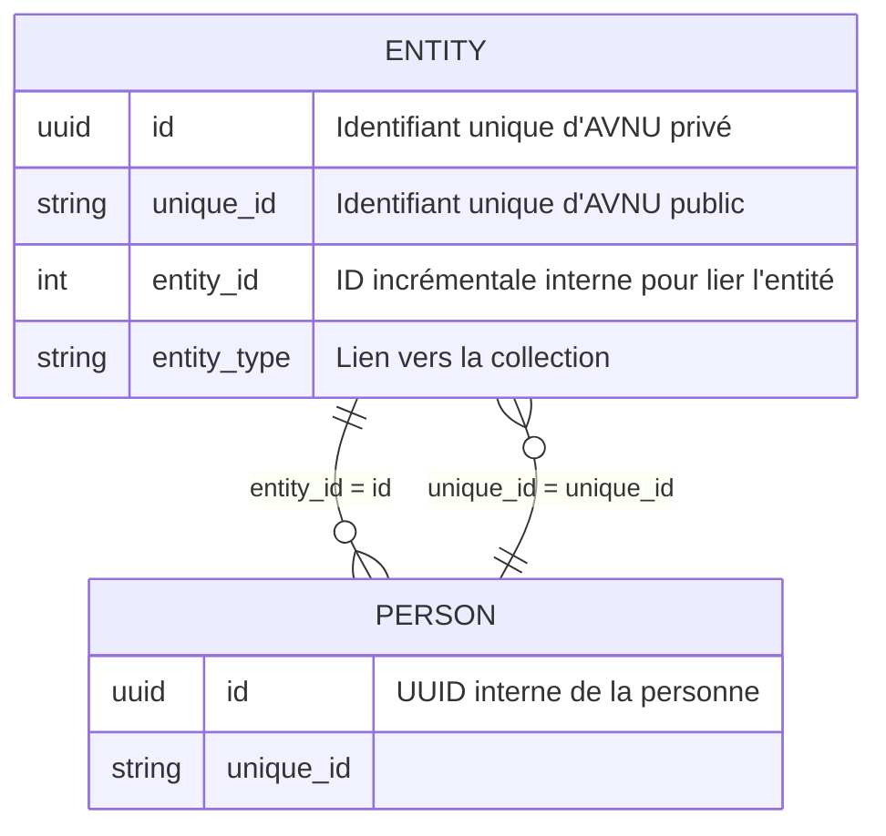

tag : #documentation_technique 

# Objectifs
Définir l'identifiant unique des entités dans la BDSOL
Permettre la liaison d'autres identifiant unique dans la BDSOL

# [[Brainstorm]] pour Identifiants

# Structure idée 2 (2026-05)
`Root domain` + `base path` + `/` `endpoint` / +  
## Root domain
`http://avnu.ca/`
### Base path 
**`/entity/`**
#### Brainstorm ^^
`/uid/`
`/p/` pour pérenne
`/e/` entity, mais on veut probablement le prendre pour endpoint.
`/ressource/` 
`/d/` pour directory / document
`/o/` (on va le prendre pour l'ontologie technique / context).
`/z/` Agent du chaos 
`/adp/` angine de poitrine

### Endpoint
`/r/` + `uid=URI`

View pour voir la données 
## UID : `AN` + `ℕ`

# Structure URI


# Exemples externes
Wikidata : http://www.wikidata.org/entity/Q5 (redirige vesr http://www.wikidata.org/wiki/Q5)
Artsdata : http://kg.artsdata.ca/resource/K12-438 (e)


# À lire 
https://www.w3.org/TR/rdf11-concepts/#section-rdf-graph
Sur les IRI, litterals.
https://docs.artsdata.ca/identifiers-guidelines/identifier-recommendations.html


# [[Conception]] pour Identifiants

# Structure
`Root domain` + `base path` + `/` `endpoint` / +  `?uid=URI`

## Identifiant pérenne
```javascript
http://avnu.ca/entity/URI
```

## Redirection vers la données
```javascript
https://api.avnu.ca/r/view?uri=http://avnu.ca/entity/URI
```

# Todo


# Planifié


# Archive
La structure d'idée 1 est partiellement réfuté. On enlève les deux première lettre du type de l'entité.
# Structure idée 1

On voit 2 pistes de structure pour les préfixe
## Avec un préfix + un nombre incrémenté

### Pour les entités
`AN` + `2 premières lettres du type d'entité` + `nombre incrémenté`
- ANPE1 (pour la personne au id 1). ou ANPE179.
- ANOR1 (pour l'organisation au id 1) ou ANOR179.
- ANPR1 - projet
- ANEV1 - événement
- ANLI1 - lieu
- ANEQ1 - équipement

Qui donnerais un identifiant unique d'url comme :
`avnu.ca/u/anpe1` `/u` = pour unique, qui donne la place à pallier si on rencontre un mur et qu'on doit supporter plus qu'une structure comme :  `avnu.ca/u-2/anpe1`


### Pour les taxonomies
`AN`+`T`+`2 premières lettre de la taxonomie`+`nombre incrémental`
`ANTCO`

Si la taxonomie est un multi mots, c'est la première lettre des 2 premiers mots. Comme secteurs d'activités : 
`ANTSA1` pour `Internet par exemple` ou `ANTTE1` pour amplificateur (type d'équipement)
## Avec un préfix + une chaine de caractère unique
`AN` + `2 premières lettre de l'entité` + `chaine unique`
ANPE + chaine unique + directement le princpal ou un deuxième pour garde le id unique privé à l'env.

par exemple :


Il y a aussi des lib pour faire des unique id plus petit. Le UUID est long.
Il y a :
- NanoID https://www.npmjs.com/package/nanoid
- KSUID https://github.com/segmentio/ksuid

## Questions
Est-ce qu'on implémenter les identifiants externe dans cette collection ou si on l'intègre directement dans le document de l'entité
```
string[] identifiers "identifiants de tous les autres base de données, wikidata, artsdata, ISNI, etc."
```

Search text devrait être implémenter en second lieux ? Et vérifier l'optimisation des importance commencé avec les entité eux même.
```
string search_text "String pour facilité la recherche par texte et indexer le contenu"
```
