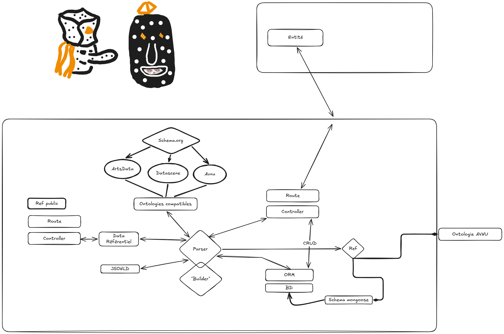

tag : #documentation_technique 

# Objectifs


# [[Brainstorm]] pour Referentiel-ontologie

Dans `/excalidraw/20260603 avnu-refactore-ajustement-ref-1.excalidraw` on a fait un schema qui présente la direction que l'on veut implémenter.


# [[Conception]] pour Referentiel-ontologie


# Structure

```javascript

```

## Exemple

```javascript

```


# Todo


# Planifié
